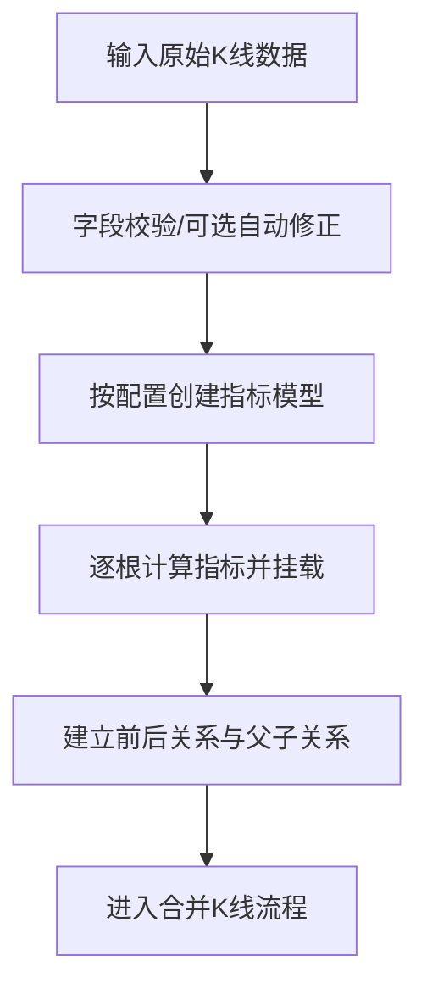

# 1. K线单元（KLine Unit）

## 定义与职责
K线单元是最小的行情数据结构，包含时间、开高低收及成交相关字段，计算指标也直接挂载在该对象上（如 MACD、BOLL、KDJ、RSI、Demark）。

## 关键字段
- 时间：`time`（`CTime`）
- 价格：`open/high/low/close`
- 成交信息：`trade_info`（包含成交量 volume、成交额 turnover、换手率 turnrate）
- 涨跌停标志：`limit_flag`（0=普通，1=涨停，-1=跌停）
- 序号：`idx`（在当前级别中的全局递增索引）
- 级别类型：`kl_type`（所属周期级别）
- 所属合并K线：`klc`（指向包含该单元的合并K线对象）
- 关系：`sup_kl`（上级K线单元）、`sub_kl_list`（下级K线单元）
- 前后链：`pre` / `next`
- 指标：`macd/boll/rsi/kdj/demark`
- 趋势指标：`trend`（字典，按类型与周期存储均线/趋势极值）

## 计算流程中的位置
K线单元由数据源逐条生成后进入合并流程，并被组合为更高层的K线结构（KLine Combine）。

## 流程图（Mermaid）


## 边界处理与异常校验
1. **价格字段异常**：
   - `low` 必须是四价最小值、`high` 必须是四价最大值，否则抛错。
   - `autofix=True` 时自动修正异常极值（避免上游数据污染后续计算）。
2. **指标序列冷启动**：
   - MACD/RSI/KDJ/BOLL 等在数据不足周期时仍会输出值（统计意义不足）。
   - 外层不会阻断，保持与行情流一致的逐点计算。
3. **指标缺省字段**：
   - 只有在配置开启时才计算（如 RSI/KDJ/Demark），未开启则字段保持空值。
4. **父子级别关系**：
   - `sub_kl_list`/`sup_kl` 仅记录关系，不参与时间一致性校验；一致性由上层负责。
5. **前后引用链**：
   - `pre/next` 由加载流程维护，不在 K 线单元内部做空指针修复。

## 实现流程
1. **建立输入**：接收包含时间、开高低收与可选成交字段的数据结构。
2. **字段校验**：检查低点/高点是否为四价极值；必要时自动修正。
3. **指标挂载**：按配置创建指标模型列表，逐根K线单元计算并写入字段。
4. **关系链接**：与前一根建立 `pre/next`，与上/下级别建立父子关系。
5. **输出**：将 K 线单元投入合并流程，后续由上层结构处理。

## 最小流程（伪代码）
```go
func BuildKLineUnit(raw Input, cfg IndicatorConfig) (*KLineUnit, error) {
    ku := NewKLineUnit(raw, cfg.AutoFix)
    models := BuildIndicatorModels(cfg)
    ku.SetMetric(models)
    return ku, nil
}
```

### 字段校验与自动修正（伪代码）
```go
func NewKLineUnit(raw Input, autoFix bool) *KLineUnit {
    if raw.High < max(raw.Open, raw.Close, raw.Low) || raw.Low > min(raw.Open, raw.Close, raw.High) {
        if !autoFix { panic("price invalid") }
        raw.High = max(raw.Open, raw.Close, raw.High)
        raw.Low = min(raw.Open, raw.Close, raw.Low)
    }
    return &KLineUnit{Open: raw.Open, High: raw.High, Low: raw.Low, Close: raw.Close, Time: raw.Time}
}
```

## 关键代码（Go 示例，可直接移植）

### 1) K线单元初始化与字段校验
```go
type KLineUnit struct {
    Time  CTime
    Open  float64
    High  float64
    Low   float64
    Close float64
}

func NewKLineUnit(kl map[string]any, autoFix bool) (*KLineUnit, error) {
    ku := &KLineUnit{
        Time:  kl[FieldTime].(CTime),
        Open:  kl[FieldOpen].(float64),
        High:  kl[FieldHigh].(float64),
        Low:   kl[FieldLow].(float64),
        Close: kl[FieldClose].(float64),
    }
    if err := ku.Check(autoFix); err != nil {
        return nil, err
    }
    return ku, nil
}
```


### 2) 指标计算挂载
```go
func (k *KLineUnit) SetMetric(models []MetricModel) {
    for _, m := range models {
        switch v := m.(type) {
        case *MACD:
            k.MACD = v.Add(k.Close)
        case *TrendModel:
            if k.Trend == nil {
                k.Trend = map[TrendType]map[int]float64{}
            }
            if k.Trend[v.Type] == nil {
                k.Trend[v.Type] = map[int]float64{}
            }
            k.Trend[v.Type][v.T] = v.Add(k.Close)
        case *Boll:
            k.Boll = v.Add(k.Close)
        case *Demark:
            k.Demark = v.Update(k.Idx, k.Close, k.High, k.Low)
        case *RSI:
            k.RSI = v.Add(k.Close)
        case *KDJ:
            k.KDJ = v.Add(k.High, k.Low, k.Close)
        }
    }
}
```


## 相关配置（影响该概念）
- `macd`：MACD 参数（默认：`fast=12, slow=26, signal=9`），用于生成MACD指标序列。
- `mean_metrics` / `trend_metrics`：均线/趋势周期（默认：空列表），用于生成趋势类指标序列。
- `boll_n`：BOLL 周期（默认：20），用于生成BOLL指标序列。
- `cal_demark`、`demark`：Demark 开关（默认：`False`）与参数（默认：`demark_len=9, setup_bias=4, countdown_bias=2, max_countdown=13, tiaokong_st=True, setup_cmp2close=True, countdown_cmp2close=True`）。
- `cal_rsi`、`rsi_cycle`：RSI 开关（默认：`False`）与周期（默认：14）。
- `cal_kdj`、`kdj_cycle`：KDJ 开关（默认：`False`）与周期（默认：9）。
