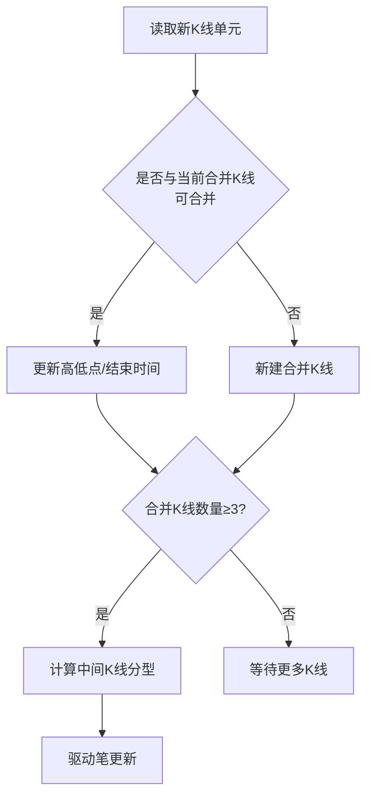

# 2. 合并K线（KLine Combine）

## 定义与职责
合并K线（KLine Combine）是对原始 K 线单元的方向性合并结果，用于分型与后续“笔”的构造。

## 关键字段
- 序号：`idx`
- 时间范围：`time_begin` / `time_end`
- 价格范围：`high` / `low`（合并后的极值）
- K线单元列表：`lst`（包含的原始K线单元）
- 方向：`dir`（UP/DOWN）
- 分型状态：`fx`（TOP/BOTTOM/UNKNOWN）
- 前后链：`pre` / `next`
- 级别类型：`kl_type`

## 关键行为
- 从 K线单元合并形成
- 维护方向与分型状态
- 负责校验分型是否有效
- 提供峰值查找：`get_peak_klu(is_high)` 返回极值所在K线单元
- 提供缺口检测：`has_gap_with_next()` 判断与下一根合并K线是否存在缺口
- 提供原始极值：`get_klu_max_high()` / `get_klu_min_low()` 返回包含K线单元中的真实极值（与合并后的 high/low 可能不同）

## 计算流程中的位置
逐根K线单元进入合并流程，合并后再触发分型更新与笔更新。

## 流程图（Mermaid）


## 边界处理与异常校验
1. **包含关系/方向判定**：
   - 仅允许四类关系：向上、向下、包含、被包含；无法归类视为数据异常。
   - 可配置是否把“被包含”拆成独立方向，不参与合并。
   - 可配置在被包含且顶部/底部相等时强制方向。
2. **一字K处理**：
   - 高低相等时不更新极值，防止错误扩大振幅。
3. **极值缓存一致性**：
   - 合并后更新 `time_end/high/low` 并清理缓存，防止峰值计算读到旧值。
4. **分型前置条件**：
   - 分型至少需要 3 根合并K线，否则不会触发。
5. **分型合法性校验**：
   - 顶分型：后继必须为底分型（虚笔时允许方向满足即可）。
   - 底分型：后继必须为顶分型（虚笔时允许方向满足即可）。
6. **分型检查方法细节**：
   - `HALF`：仅用前两根参与判断。
   - `LOSS`：只使用当前分型K线。
   - `STRICT/TOTALLY`：使用前后各一根，且在 `TOTALLY` 下要求完全分离。
7. **异常类型**：
   - 合并方向未知、分型参数非法应终止计算或记录错误。
8. **合并稳定性**：
   - 若连续多根K线均被合并，方向应保持一致，直到出现明确反向走势。
9. **跨段重置**：
   - 当数据源发生跳变（如断档重连），应显式重置合并状态与方向缓存。

## 实现流程
1. **初始化合并器**：以第一根K线单元建立合并K线，并记录方向。
2. **逐根合并**：对每一根新K线单元判断包含/被包含/向上/向下。
3. **合并更新**：若可合并，则更新高低点与结束时间；否则新建合并K线。
4. **分型触发**：当合并K线数 ≥ 3 时，计算中间K线的分型。
5. **笔驱动**：将分型结果交给“笔”模块进行起止判定。
6. **异常处理**：若方向无法判定或参数非法，记录错误并终止或跳过。

## 最小流程（伪代码）
```go
func CombineKLines(list []*KLine, unit *KLineUnit) {
    if len(list) == 0 { appendNew(list, unit); return }
    dir := list[len(list)-1].TryAdd(unit)
    if dir != DirCombine {
        appendNew(list, unit)
        if len(list) >= 3 { calcFX(list) }
    }
}
```

### 方向判定与跨段重置（伪代码）
```go
func TestCombine(cur *KLine, item *CombineItem) KLineDir {
    rel := DetectRelation(cur, item) // up/down/include/included
    if rel == RelUnknown { panic("dir unknown") }
    if rel == RelIncluded && config.ExcludeIncluded { return DirNew }
    return RelToDir(rel, config.AllowTopEqual)
}

func ResetOnGap(gapDetected bool, list []*KLine) {
    if gapDetected { clear(list); resetDirCache() }
}
```

## 关键代码（Go 示例，可直接移植）

### 1) 合并规则与方向判断
```go
func (k *KLine) TryAdd(unit *KLineUnit) KLineDir {
    item := NewCombineItem(unit)
    dir := k.TestCombine(item)
    if dir == DirCombine {
        k.List = append(k.List, unit)
        unit.KLine = k
        if k.Dir == DirUp {
            k.High = max(k.High, item.High)
            k.Low = max(k.Low, item.Low)
        } else if k.Dir == DirDown {
            k.High = min(k.High, item.High)
            k.Low = min(k.Low, item.Low)
        }
        k.TimeEnd = item.TimeEnd
    }
    return dir
}
```


### 2) 合并入口（逐根K线驱动）
```go
func (l *KLineList) AddSingleKLU(klu *KLineUnit) {
    klu.SetMetric(l.MetricModels)
    if len(l.List) == 0 {
        l.List = append(l.List, NewKLine(klu, 0, DirUp))
        return
    }
    dir := l.List[len(l.List)-1].TryAdd(klu)
    if dir != DirCombine {
        l.List = append(l.List, NewKLine(klu, len(l.List), dir))
        if len(l.List) >= 3 {
            l.List[len(l.List)-2].UpdateFX(l.List[len(l.List)-3], l.List[len(l.List)-1])
        }
    }
}
```


## 相关配置（影响该概念）
- `bi_fx_check`：分型检查方法（默认：`strict`），影响分型合法性判定。
- `bi_end_is_peak`：笔结束是否必须是极值（默认：`True`）。
- `gap_as_kl`：缺口是否当作独立 K 线（默认：`False`）。
- `bi_allow_sub_peak`：是否允许子峰值更新（默认：`True`）。
