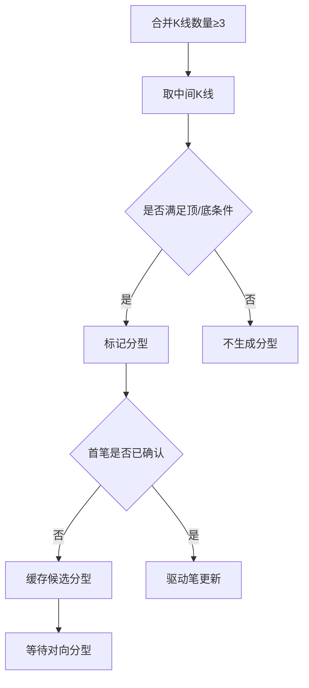

# 3. 分型（FX）

## 定义与职责
分型（顶/底）是由相邻合并K线构成的局部形态，用于判定“笔”的起止方向。

- 相关枚举：`FX_TYPE`（TOP/BOTTOM/UNKNOWN）
- 分型检查方法：`FX_CHECK_METHOD`

## 计算流程中的位置
在合并K线更新流程中，当合并K线数量满足条件时计算分型，随后驱动笔的生成。

## 流程图（Mermaid）


## 边界处理与异常校验
1. **分型需要前后K线**：
   - 分型至少需要三根合并K线；不足三根时不生成分型。
2. **分型合法性强校验（check_fx_valid）**：
   - 顶分型要求后继为底分型；底分型要求后继为顶分型。
   - `FX_CHECK_METHOD` 决定比较范围（以顶分型为例，底分型对称）：
     - `HALF`：`item2_high = max(对向.pre.high, 对向.high)`，`self_low = min(当前.low, 当前.next.low)`。
     - `LOSS`：`item2_high = 对向.high`，`self_low = 当前.low`。
     - `STRICT`：`item2_high = max(对向.pre.high, 对向.high, 对向.next.high)`，`self_low = min(当前.pre.low, 当前.low, 当前.next.low)`。
     - `TOTALLY`：同 STRICT 范围，但要求完全分离（当前.low > 对向_high）。
   - STRICT/LOSS/HALF 最终判定：`当前.high > item2_high` **且** `对向.low < self_low`。
   - 虚笔模式下，对向.next 可能不存在，仅取 `max(对向.pre.high, 对向.high)`。
3. **虚笔的分型校验**：
   - 虚笔模式下，只检查方向（`dir`），不强制 `fx` 状态。
4. **分型未知**：
   - 分型为 UNKNOWN 时不会生成新笔，只允许虚笔更新。
5. **首个分型落在区间中部**：
   - 需要维护“候选分型缓存”，只有出现对向分型后才确认首笔。
   - 候选缓存只保留最新同向分型，避免被旧极值干扰。
6. **首笔跨度不足**：
   - 严格模式下首笔跨度必须满足最小K线数量，否则继续等待。
7. **尾部未成型**：
   - 允许虚笔存在，若后续确认则回写为实笔，否则回滚。
   - 回滚条件：新分型被判无效或被更极端同向分型替代。
8. **分型重复与相邻冲突**：
   - 若新分型与上一个分型方向相同，则只尝试更新尾部极值，不新增笔。
9. **极值不足**：
   - 若分型高低点不满足“高于/低于相邻K线”的约束，分型直接判无效。
10. **虚笔确认规则**：
   - 若下一次出现对向分型且跨度满足条件，则将虚笔转实笔并固化起止。
   - 若连续多次仅出现同向分型，则持续更新虚笔尾部极值。

## 实现流程
1. **触发条件**：当合并K线数量 ≥ 3 时，检查中间K线是否构成分型。
2. **顶/底判断**（普通模式，非 exclude_included）：
   - 顶分型：`pre.high < mid.high && next.high < mid.high && pre.low < mid.low && next.low < mid.low`。
   - 底分型：`pre.high > mid.high && next.high > mid.high && pre.low > mid.low && next.low > mid.low`。
   - exclude_included 模式下条件略有放宽，允许 next 与 mid 顶/底相等时由 `allow_top_equal` 决定。
3. **方法差异**：根据 `FX_CHECK_METHOD` 调整比较范围（HALF/LOSS/STRICT/TOTALLY）。
4. **确认分型**：若满足条件，标记中间K线为顶或底。
5. **首笔处理**：若已有候选分型缓存，遇到对向分型即确认首笔；否则缓存。
6. **冲突处理**：若连续分型同向，则只更新尾部极值。
7. **尾部虚笔**：末尾未成型时允许虚笔存在，后续确认则转实笔，否则回滚。
8. **虚笔确认**：对向分型满足跨度后，固化虚笔并输出笔起止。

## 最小流程（伪代码）
```go
func CalcFX(list []*KLine) {
    if len(list) < 3 { return }
    mid := list[len(list)-2]
    pre := list[len(list)-3]
    next := list[len(list)-1]
    if IsTop(pre, mid, next) { mid.FX = FXTop }
    if IsBottom(pre, mid, next) { mid.FX = FXBottom }
}
```

### 虚笔确认与候选缓存（伪代码）
```go
func UpdateFirstStroke(cache *KLine, fx *KLine) *KLine {
    if cache == nil { return fx }
    if cache.FX == fx.FX { return moreExtreme(cache, fx) }
    if spanEnough(cache, fx) { confirmStroke(cache, fx); return nil }
    return fx
}
```

## 关键代码（Go 示例，可直接移植）

### 1) 分型判定逻辑（顶/底）
```go
func (k *KLine) UpdateFX(pre, next *KLine, excludeIncluded bool, allowTopEqual *int) {
    k.Next = next
    k.Pre = pre
    next.Pre = k
    if excludeIncluded {
        if pre.High < k.High && next.High <= k.High && next.Low < k.Low {
            if allowTopEqual != nil && *allowTopEqual == 1 || next.High < k.High {
                k.FX = FXTop
            }
        } else if next.High > k.High && pre.Low > k.Low && next.Low >= k.Low {
            if allowTopEqual != nil && *allowTopEqual == -1 || next.Low > k.Low {
                k.FX = FXBottom
            }
        }
        return
    }
    if pre.High < k.High && next.High < k.High && pre.Low < k.Low && next.Low < k.Low {
        k.FX = FXTop
    } else if pre.High > k.High && next.High > k.High && pre.Low > k.Low && next.Low > k.Low {
        k.FX = FXBottom
    }
}
```


### 2) 分型触发点
```go
if len(list) >= 3 {
    list[len(list)-2].UpdateFX(list[len(list)-3], list[len(list)-1], false, nil)
}
```


## 相关配置（影响该概念）
- `bi_fx_check`：分型检查方法（默认：`strict`）。
- `bi_strict`：是否使用严格笔（默认：`True`）。
