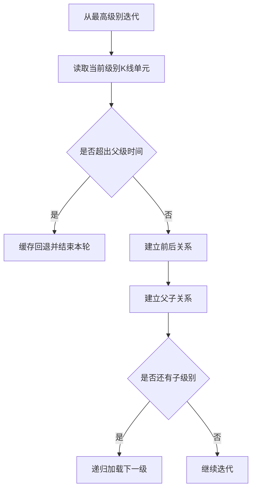

# 4. 周期与级别（KL_TYPE / Multi-level）

## 定义与职责
多周期联动计算（如日线+60分钟+30分钟），并通过父子关系将不同级别的 K 线单元组织成层级结构。

## 级别枚举值
- `K_1M`：1分钟
- `K_3M`：3分钟
- `K_5M`：5分钟
- `K_15M`：15分钟
- `K_30M`：30分钟
- `K_60M`：60分钟
- `K_DAY`：日线
- `K_WEEK`：周线
- `K_MON`：月线
- `K_QUARTER`：季线
- `K_YEAR`：年线

## 计算流程中的位置
以最高级别为入口，递归加载次级别数据，并在加载过程中建立父子关系。

## 流程图（Mermaid）


## 边界处理与异常校验
1. **K线时间单调性**：
   - 当前时间不大于上一条时间时视为数据异常，必须终止或修正。
2. **父子级别时间不一致**：
   - 父子年月日不一致会累计告警，超过阈值终止计算。
3. **次级别缺失**：
   - 上级K线未找到任何子级别K线则累计计数，超过阈值终止计算。
4. **无数据保护**：
   - 最高级别无数据时立即终止计算。
5. **迭代边界与缓存回退**：
   - 子级别时间超过父级别结束时间时，将其缓存并在下一轮继续处理，避免错配。
6. **跳过非法子级别**：
   - 若配置允许，可在某个子级别数据源缺失时跳过该级别。
7. **对齐检查**：
   - 每个父级K线都应至少关联一个子级K线，否则视为对齐失败。
8. **时间粒度差异**：
   - 日内级别用结束时间对齐，日以上级别用当天日期对齐。

## 关键代码（Go 示例，可直接移植）

### 1) 多级别递归载入
```go
func (c *Chan) loadIterator(lvIdx int, parent *KLineUnit, step bool) {
    curLv := c.LvList[lvIdx]
    var pre *KLineUnit
    if len(c.KLData[lvIdx].List) > 0 {
        lastKLC := c.KLData[lvIdx].List[len(c.KLData[lvIdx].List)-1]
        if len(lastKLC.List) > 0 {
            pre = lastKLC.List[len(lastKLC.List)-1]
        }
    }
    for {
        klineUnit, ok := c.getNextLvKLU(lvIdx)
        if !ok {
            break
        }
        c.trySetKLUIdx(lvIdx, klineUnit)
        if parent != nil && klineUnit.Time.GT(parent.Time) {
            c.KLUCache[lvIdx] = klineUnit
            break
        }
        klineUnit.SetPreKLU(pre)
        pre = klineUnit
        c.addNewKL(curLv, klineUnit)
        if parent != nil {
            c.setKLUParentRelation(parent, klineUnit, curLv, lvIdx)
        }
        if lvIdx != len(c.LvList)-1 {
            c.loadIterator(lvIdx+1, klineUnit, step)
        }
    }
}
```


### 2) 建立父子关系与一致性检查
```go
func (c *Chan) setKLUParentRelation(parent, child *KLineUnit, curLv KLType, lvIdx int) {
    if c.Conf.KLDataCheck && klTypeLteDay(curLv) && klTypeLteDay(c.LvList[lvIdx-1]) {
        c.checkKLConsistent(parent, child)
    }
    parent.AddChildren(child)
    child.SetParent(parent)
}
```


## 实现流程
1. **初始化级别列表**：按用户配置从高到低排序（如 DAY → 60M → 30M）。
2. **迭代最高级**：逐根读取K线单元，建立前后关系并加入合并流程。
3. **递归加载子级**：每读取一根父级K线单元后，立即递归加载其子级别数据。
4. **父子关系**：子级K线单元的时间必须落在父级时间范围内，否则缓存回退。
5. **一致性校验**：校验时间单调性、父子对齐、时间一致性。

## 最小流程（伪代码）
```go
func LoadMultiLevel(lvList []KLType) {
    for _, klu := range dataSource(lvList[0]) {
        addKL(lvList[0], klu)
        if len(lvList) > 1 {
            loadSubLevel(lvList[1:], klu)
        }
    }
}
```

## 相关配置（影响该概念）
- `kl_data_check`：是否校验父子级别时间一致性（默认：`True`）。
- `max_kl_misalgin_cnt`：次级别缺失阈值（默认：`2`）。
- `max_kl_inconsistent_cnt`：父子级别时间不一致阈值（默认：`5`）。
- `auto_skip_illegal_sub_lv`：子级别数据缺失时是否自动跳过（默认：`False`）。
