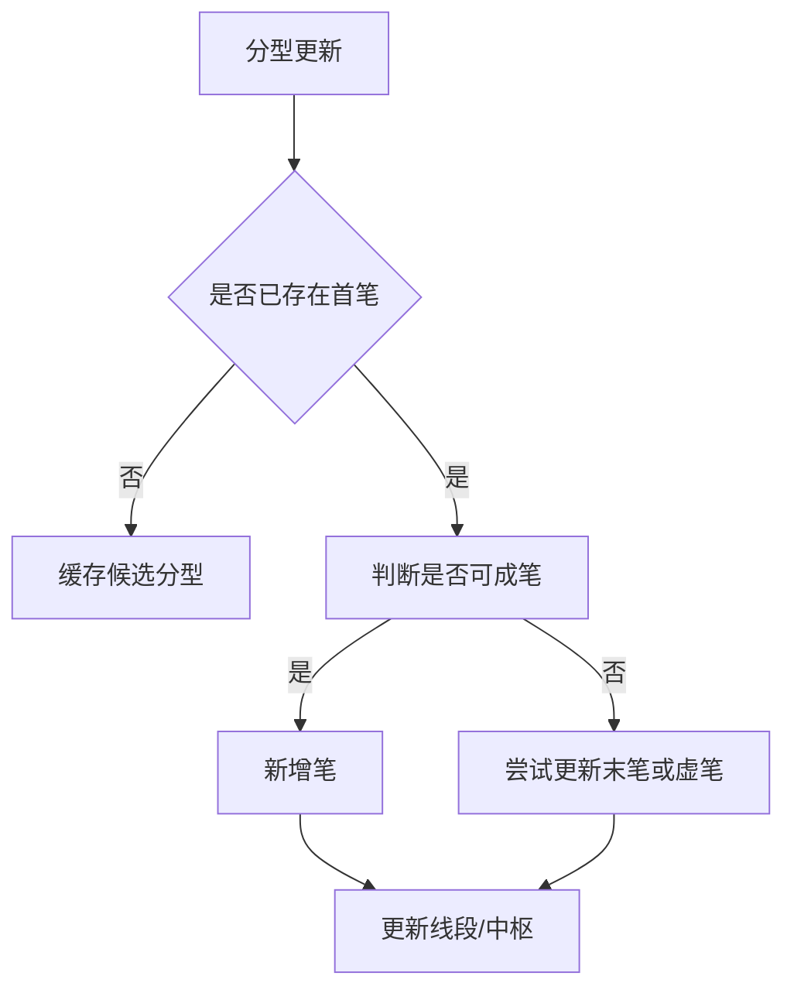

# 5. 笔（Bi）

## 定义与职责
笔是由相邻分型（顶/底）确定的最小趋势单元，是线段和中枢的基础。

## 关键字段
- 起点/终点：`begin_klc` / `end_klc`（指向合并K线）
- 方向：`dir`（UP/DOWN）
- 是否确定：`is_sure`
- 前后链：`pre` / `next`
- 所属线段索引：`seg_idx`
- 所属线段：`parent_seg`
- 虚笔确认缓存：`sure_end`（虚笔转实笔时保存的确定端点列表）
- 索引：`idx`

## 计算流程中的位置
分型确认后进入笔的更新流程；笔确定后再驱动线段与中枢更新。

## 流程图（Mermaid）


## 边界处理与异常校验
1. **首笔尚未形成**：
   - 维护候选分型缓存（`free_klc_lst`），只有对向分型且跨度满足才生成首笔。
   - 候选缓存内同向分型会被跳过，仅对向分型参与匹配。
2. **分型未知**：
   - `UNKNOWN` 分型不生成新笔，仅可能更新虚笔。
3. **跨度不足**：
   - 严格模式（`bi_strict=True`）：合并K线索引差 ≥ 4。
   - 非严格模式：索引差 ≥ 3 **且** 中间K线单元总数 ≥ 3。
4. **方向一致更新（try_update_end）**：
   - 若新分型与末笔方向一致且极值更极端，更新末笔尾部。
5. **虚笔回滚（delete_virtual_bi）**：
   - 每次确定更新前，先删除末尾虚笔。
   - 若虚笔有 `sure_end` 缓存，则从第一个 sure_end 恢复，并依次补回后续 sure_end 为确定笔。
   - 若无 sure_end，直接删除虚笔。
6. **端点必须是极值（end_is_peak）**：
   - 从起点到终点遍历所有中间合并K线，确保无中间K线超过终点极值。
   - 上笔：中间所有 high 不得超过终点 high。
   - 下笔：中间所有 low 不得低于终点 low。
7. **缺口计入跨度**：
   - `gap_as_kl=True` 时，相邻K线间无重叠视为额外跨度+1。
8. **子峰更新（update_peak）**：
   - `bi_allow_sub_peak=False` 时，若新分型无法成笔且末两笔满足特定极值条件，回退末笔并尝试更新倒数第二笔的终点。
   - 条件：末笔终值不超过倒二笔起值，且从倒二笔起点到新分型满足 end_is_peak。
9. **虚笔新增（try_add_virtual_bi）**：
   - 若末笔方向一致且极值更极端，直接更新末笔虚端点。
   - 否则从最后K线向前遍历，尝试找到可成虚笔的位置。

## 实现流程
1. **首笔判断**：若无已确定笔，先缓存候选分型。
2. **成笔判断**：检查方向、跨度、分型合法性、端点极值。
3. **新增或更新**：满足条件则新增笔，否则更新末笔或虚笔。
4. **虚笔处理**：末尾允许虚笔存在，后续确认则转实笔。

## 最小流程（伪代码）
```go
func UpdateBi(klc *KLine) {
    if klc.FX == FXUnknown { tryVirtual(klc); return }
    if lastEnd == nil { cacheFirst(klc); return }
    if klc.FX == lastEnd.FX { tryUpdateEnd(klc); return }
    if canMakeBi(klc, lastEnd) { addNewBi(lastEnd, klc); return }
    tryUpdatePeak(klc)
}
```

### 成笔判定与跨度（伪代码）
```go
func canMakeBi(cur, last *KLine) bool {
    if cfg.BiAlgo != "fx" && !satisfySpan(cur, last) { return false }
    if !checkFxValid(last, cur, cfg.BiFxCheck) { return false }
    if cfg.BiEndIsPeak && !endIsPeak(last, cur) { return false }
    return true
}
```

## 相关配置（影响该概念）
- `bi_algo`：笔算法（默认：`normal`；`fx` 可跳过跨度约束）。
- `bi_strict`：严格笔（默认：`True`）。
- `bi_fx_check`：分型检查方法（默认：`strict`）。
- `gap_as_kl`：缺口视为K线（默认：`False`）。
- `bi_end_is_peak`：端点必须为极值（默认：`True`）。
- `bi_allow_sub_peak`：是否允许子峰更新（默认：`True`）。
