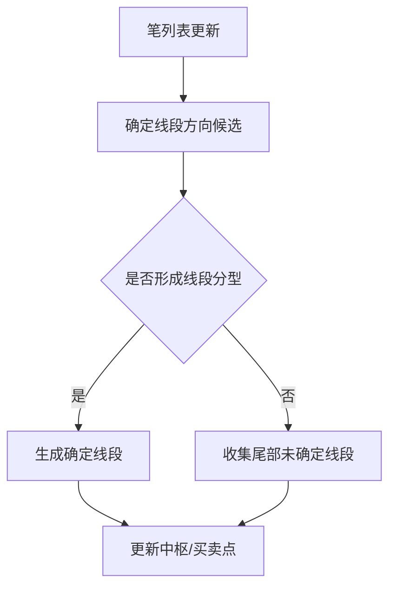

# 6. 线段（Seg）

## 定义与职责
线段由多笔构成，用于刻画更高一级的趋势结构，并作为中枢与买卖点计算的基础。

## 关键字段
- 起始/结束笔：`start_bi` / `end_bi`
- 方向：`dir`（UP/DOWN）
- 是否确定：`is_sure`
- 前后链：`pre` / `next`
- 线段包含的笔列表：`bi_list`
- 中枢列表：`zs_lst`（线段内部的中枢序列）
- 线段分型特征：`eigen_fx`（CEigenFX 对象，记录形成该线段的特征序列分型）
- 索引：`idx`
- 所属上级线段：`seg_idx` / `parent_seg`
- 买卖点：`bsp`（尾部是否是买卖点）
- 趋势线：`support_trend_line` / `resistance_trend_line`（笔数 ≥3 时自动计算）
- 原因：`reason`（生成原因标记，如 normal/split_first/collectleft 等）

## 计算流程中的位置
当笔更新后，线段列表按算法策略更新；线段确认后驱动中枢与买卖点。

## 流程图（Mermaid）


## 核心概念：特征序列分型（EigenFX）
线段的判定依赖“特征序列分型”：
1. 取与线段方向**相反**的笔作为特征元素（上升线段取下笔，下降取上笔）。
2. 将特征元素如同 K线合并一样进行包含合并，形成三个特征元素（ele[0]/ele[1]/ele[2]）。
3. 若三个元素构成顶/底分型，则线段结束。
4. 若前两元素就不可能成分型（如上升线段中第二元素 high < 第一元素 high），则重置并从第二元素重新开始。
5. 当特征元素中存在缺口（gap）时，需要在后续笔中确认是否存在反向分型（`can_be_end` + `find_revert_fx`）。

## 边界处理与异常校验
1. **线段长度**：
   - 线段最少包含 3 笔（端点间索引差≥2），否则自动设为不确定线段。
2. **起止值约束**：
   - 上升线段起点不得高于终点；下降线段起点不得低于终点；违反则报错（确定线段时）。
3. **首段拆分（split_first_seg）**：
   - 当第一段结束笔索引 ≥3 时，尝试向前寻找峰值笔将首段拆为两段。
   - 峰值笔必须比第一笔更极端（或索引为0）才能生效。
4. **尾部补线段（collect_left_seg）**：
   - `left_seg_method=peak`：在剩余笔中寻找峰值笔，生成不确定线段，可递归多次。
   - `left_seg_method=all`：所有剩余笔直接归为一段不确定线段。
5. **特征序列重置**：
   - 当前两元素不可能成分型或第三元素未实际突破时，重置并从第二元素重新开始。
6. **异常处理**：
   - 起止值异常在首段时忽略，非首段则报错。

## 实现流程
1. **初始化**：清理尾部不确定线段，保持确定段稳定。
2. **遍历笔**：取与当前线段方向相反的笔，逐个加入 EigenFX。
3. **元素合并**：特征元素按K线合并规则处理包含关系。
4. **分型判定**：三个元素就绪后检查是否构成分型，上升线段找顶分型，下降找底。
5. **确定线段**：分型成立则生成线段，绑定笔列表并计算趋势线。
6. **尾部处理**：若尾部不足形成确定线段，按 `left_seg_method` 收集为未确定线段。

## 最小流程（伪代码）
```go
func UpdateSegs(biList []*Bi) {
    initSegList()
    eigenFx := NewEigenFX(curDir)
    for _, bi := range biList {
        if bi.Dir == curDir { continue } // 只取反向笔
        if eigenFx.Add(bi) { // 返回 true 表示出现分型
            addNewSeg(biList, eigenFx.GetPeakBiIdx())
            eigenFx = NewEigenFX(revertDir(curDir))
        }
    }
    collectLeftSeg(biList)
}
```

### 特征序列分型逻辑（伪代码）
```go
func (e *EigenFX) Add(bi *Bi) bool {
    e.Lst = append(e.Lst, bi)
    if e.Ele[0] == nil { e.Ele[0] = NewEigen(bi); return false }
    if e.Ele[1] == nil { return e.treatSecond(bi) }
    if e.Ele[2] == nil { return e.treatThird(bi) }
    panic("3 elements already")
}

func (e *EigenFX) treatThird(bi *Bi) bool {
    combineDir := e.Ele[1].TryAdd(bi)
    if combineDir == DirCombine { return false }
    e.Ele[2] = NewEigen(bi)
    if !e.actualBreak() { return e.reset() }
    e.Ele[1].UpdateFX(e.Ele[0], e.Ele[2])
    isFx := (e.IsUp() && e.Ele[1].FX == FXTop) || (e.IsDown() && e.Ele[1].FX == FXBottom)
    if isFx { return true }
    return e.reset()
}
```

### 线段合法性检查（伪代码）
```go
func CheckSeg(seg *Seg) bool {
    if seg.IsSure && seg.EndBi.Idx - seg.StartBi.Idx < 2 { return false }
    if seg.IsUp && seg.BeginVal > seg.EndVal { return false }
    if seg.IsDown && seg.BeginVal < seg.EndVal { return false }
    return true
}
```

## 相关配置（影响该概念）
- `seg_algo`：线段算法（默认：`chan`）。使用特征序列分型（EigenFX）进行线段判定。
- `left_seg_method`：尾部线段收集方式（默认：`peak`）。
  - `peak`：在剩余笔中寻找峰值笔生成不确定线段，可递归多次。
  - `all`：所有剩余笔归为一段不确定线段（容易找不到二类买卖点）。
