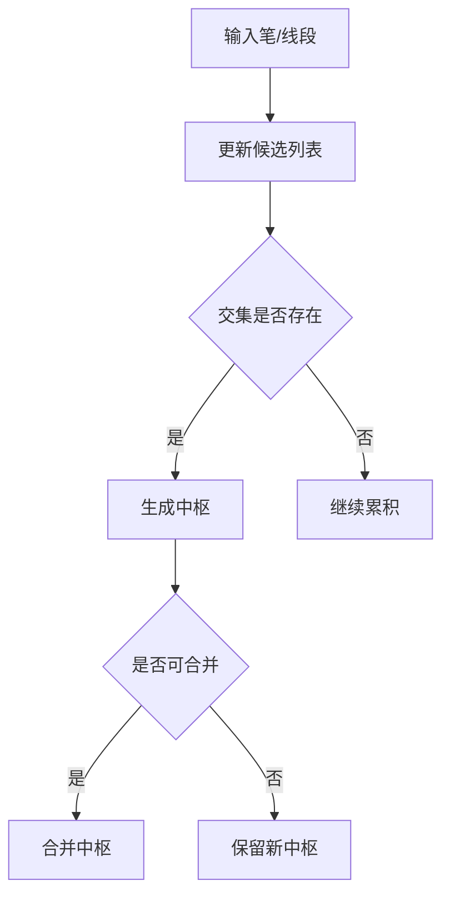

# 7. 中枢（ZS）

## 定义与职责
中枢是由连续笔（或线段）在区间内反复重叠形成的价格震荡区，用于判断趋势延续与买卖点。

## 关键字段
- 区间上界/下界：`high` / `low`（参与元素的最低高点 / 最高低点）
- 峰值范围：`peak_high` / `peak_low`（中枢涉及的所有笔的最大值/最小值）
- 中点：`mid`（`(low + high) / 2`）
- 起止笔：`begin_bi` / `end_bi`（中枢内部的笔）
- 起止时间：`begin` / `end`（指向 KLineUnit）
- 进出笔：`bi_in` / `bi_out`（进中枢与出中枢的笔）
- 中枢内笔列表：`bi_lst`（begin_bi 到 end_bi 之间的笔）
- 是否确定：`is_sure`
- 子中枢列表：`sub_zs_lst`（合并后保留的原始中枢）

## 计算流程中的位置
线段或笔更新后触发中枢更新；中枢确认后作为买卖点判定的输入。

## 流程图（Mermaid）


## 边界处理与异常校验
1. **不足以构成中枢**：
   - `one_bi_zs=False`（默认）时，仅 1 笔不生成中枢，至少需要 2 笔。
   - `one_bi_zs=True` 时允许单笔中枢。
2. **交集为空**：
   - `min_high = min(各笔._high())`, `max_low = max(各笔._low())`，若 `min_high <= max_low` 则不成枢。
3. **首笔限制**：
   - `begin_bi.idx > 0` 才允许生成中枢，禁止第一笔就是中枢起点。
4. **尾部延伸（try_add_to_end）**：
   - 当新笔与中枢有重叠时，直接扩展中枢尾部（peak 模式下生效）。
   - 单笔中枢延伸时会重新计算 low/high 范围。
5. **中枢合并**：
   - `zs_combine=True` 时，新中枢尝试与前一中枢合并，直到无法合并。
   - `zs_combine_mode=zs`：比较 low/high 重叠（含相等）。
   - `zs_combine_mode=peak`：比较 peak_low/peak_high 重叠。
   - 合并后保留原始中枢到 `sub_zs_lst`。
   - 不合并单笔中枢；不跨线段合并。
6. **每线段内计算逻辑（normal 模式）**：
   - 遍历线段内的笔，**跳过与线段同向的笔**，仅用反向笔构建中枢。
   - 处理完所有确定线段后，再处理未生成新线段的尾部笔。

## 实现流程
1. **按线段遍历**（normal模式）：每个线段清空候选列表，用反向笔构建中枢。
2. **候选列表维护**：逐笔加入 `free_item_lst`，尝试构建中枢。
3. **交集判断**：`min_high > max_low` 则成枢，清空候选列表。
4. **尾部延伸**：新笔与中枢重叠时延伸尾部。
5. **合并处理**：新中枢生成后尝试与前一中枢合并，直到无法合并。
6. **设置 bi_in/bi_out**：由上层 `update_zs_in_seg` 设置进出中枢笔。

## 最小流程（伪代码）
```go
func (zl *ZSList) CalBiZS(biList []*Bi, segList []*Seg) {
    for _, seg := range segList {
        zl.ClearFree()
        for _, bi := range biList[seg.StartBi.Idx : seg.EndBi.Idx+1] {
            if bi.Dir == seg.Dir { continue } // 跳过同向笔
            zl.Update(bi, seg.IsSure)
        }
    }
    // 处理未生成线段的尾部
    zl.ClearFree()
    for _, bi := range biList[lastSeg.EndBi.Idx+1:] {
        zl.Update(bi, false)
    }
}

func (zl *ZSList) Update(bi *Bi, isSure bool) {
    if len(zl.FreeLst) == 0 && zl.TryAddToEnd(bi) {
        zl.TryCombine()
        return
    }
    zl.AddToFree(bi, isSure)
}
```

### 交集判定与构建（伪代码）
```go
func TryConstructZS(lst []*Bi, isSure bool, oneBiZs bool) *ZS {
    if !oneBiZs && len(lst) < 2 { return nil }
    candidates := lst[len(lst)-2:]
    minHigh := min(item.High() for item in candidates)
    maxLow := max(item.Low() for item in candidates)
    if minHigh > maxLow { return NewZS(candidates, isSure) }
    return nil
}
```

### 中枢合并（伪代码）
```go
func (zs *ZS) Combine(zs2 *ZS, mode string) bool {
    if zs2.IsOneBiZs() { return false }
    if zs.BeginBi.SegIdx != zs2.BeginBi.SegIdx { return false }
    if mode == "zs" {
        if !HasOverlap(zs.Low, zs.High, zs2.Low, zs2.High) { return false }
    } else if mode == "peak" {
        if !HasOverlap(zs.PeakLow, zs.PeakHigh, zs2.PeakLow, zs2.PeakHigh) { return false }
    }
    zs.DoCombine(zs2)
    return true
}
```

## 相关配置（影响该概念）
- `zs_combine`：是否合并中枢（默认：`True`）。
- `zs_combine_mode`：合并模式（默认：`zs`）。
  - `zs`：比较中枢的 low/high 是否重叠。
  - `peak`：比较中枢的 peak_low/peak_high 是否重叠。
- `one_bi_zs`：允许单笔中枢（默认：`False`）。
- `zs_algo`：中枢算法（默认：`normal`）。
  - `normal`：每个线段内独立计算中枢，跳过同向笔。
  - `over_seg`：跨线段计算中枢，需要至少 3 笔，且第一笔方向不能与父线段同向。
  - `auto`：确定线段内用 normal，不确定线段内用 over_seg。
