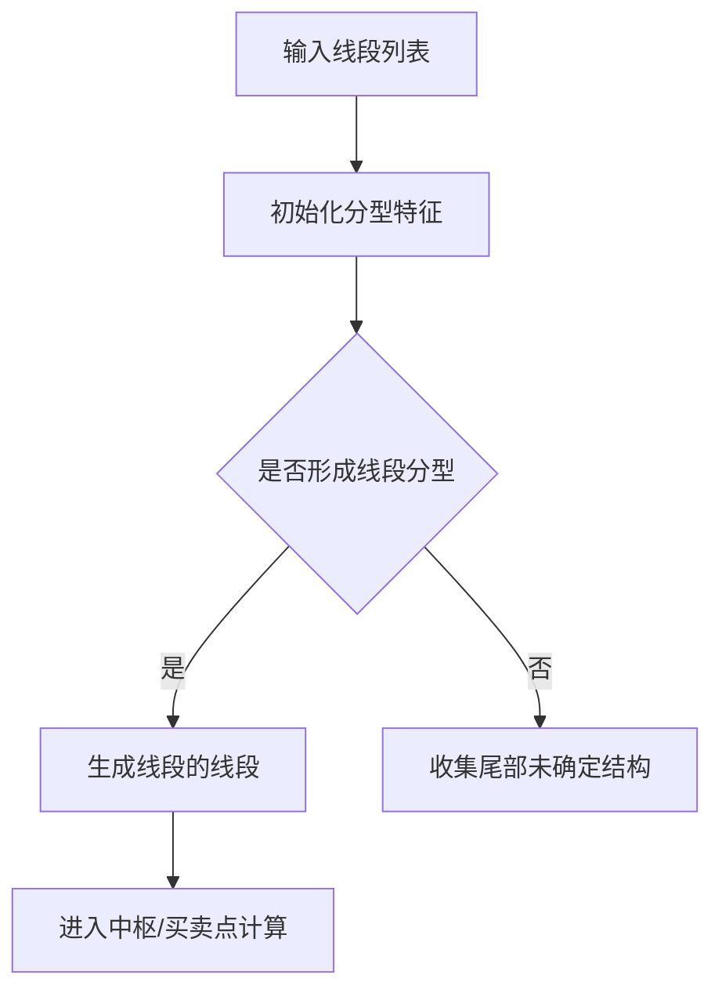

# 8. 线段的线段（SegSeg）

## 定义与职责
线段的线段是以“线段”作为输入再次构建的高一级结构，用于刻画更长期的趋势脉络。

> **核心设计：** 线段的线段完全复用“线段”的算法与数据结构（`CSeg`），只是泛型参数从 `CBi` 改为 `CSeg`。特征序列分型、包含合并、尾部收集等逻辑完全一致。

## 关键字段
- 起始/结束线段：`start_bi`（即起始线段） / `end_bi`（即结束线段）
- 方向：`dir`（UP/DOWN）
- 是否确定：`is_sure`
- 元素列表：`bi_list`（包含的线段序列）
- 中枢列表：`zs_lst`（线段的线段内部的中枢，元素为线段）
- 买卖点：`bsp`（线段级买卖点）
- 特征分型：`eigen_fx`
- 前后链：`pre` / `next`
- 索引：`idx`

## 计算流程中的位置
在线段列表更新后，按相同方法在更高层级生成线段的线段。

## 流程图（Mermaid）


## 边界处理与异常校验
1. **结构长度**：
   - 至少需要 3 个线段元素（端点索引差 ≥2），否则自动设为未确定。
2. **起止值约束**：
   - 与线段相同：上升起点不得高于终点，下降起点不得低于终点。
3. **尾部收集**：
   - 与线段相同：按 `left_seg_method` 收集未确定结构。
4. **自身拥有 ZS 和 BSP**：
   - 线段的线段也拥有自己的中枢列表（`zs_lst`）和买卖点（`bsp`），计算方式与笔级线段完全一致，只是元素为线段而非笔。
5. **线段级背驰指标**：
   - 线段的 `cal_macd_metric` 仅支持 `slope` 和 `amp` 两种算法，与笔级不同。

## 实现流程
1. **输入线段**：以线段作为“元素”进入与笔级线段完全相同的特征序列分型流程。
2. **判定结构分型**：取与当前方向相反的线段作为特征元素，满足分型条件时生成确定结构。
3. **尾部处理**：不足以确定时按 `left_seg_method` 收集未确定结构。
4. **中枢计算**：对生成的线段的线段计算中枢（用线段作为元素）。
5. **买卖点计算**：对线段级中枢计算买卖点（仅支持 slope/amp 算法）。

## 最小流程（伪代码）
```go
func UpdateSegSeg(segList []*Seg) {
    initSegSeg()
    for seg := range segList {
        if eigenFxReady(seg) { addNewSegSeg(seg) }
    }
    collectLeftSegSeg(segList)
}
```

## 相关配置（影响该概念）
- `seg_algo`：线段算法（默认：`chan`）。
- `left_seg_method`：尾部线段收集方式（默认：`peak`）。
