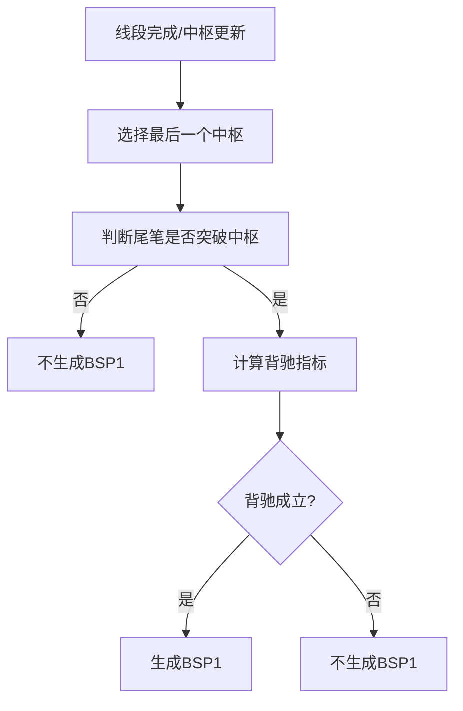

# 9. 一类买卖点（BSP1）

## 定义与职责
一类买卖点用于确认趋势背驰后的第一类转折点，通常依赖“中枢背驰”或“盘整背驰”。

## 关键字段
- 关联笔：`bi`（触发买卖点的笔）
- 类型：`T1`（趋势背驰）或 `T1P`（盘整背驰）
- 是否买点：`is_buy`（下跌笔为买点，上涨笔为卖点）
- 特征：`divergence_rate`（背驰比值）
- 关联一类：无（BSP1 本身就是一类）

## 计算流程中的位置
当线段确认并产生中枢后，基于最后一个中枢与尾部笔判断是否出现一类买卖点。

## 流程图（Mermaid）


## 边界处理与异常校验
1. **尾笔未突破中枢（end_bi_break）**：
   - 下跌笔：`bi._low() < zs.low`；上涨笔：`bi._high() > zs.high`。
   - 未突破则不生成 T1，转为尝试 T1P。
2. **背驰比值不足**：
   - `out_metric > divergence_rate * in_metric` 时判定无背驰，但仍可记录为非目标买卖点。
   - `divergence_rate` 默认为 `inf`，意味着默认始终判定背驰成立。
3. **峰值检查（out_bi_is_peak）**：
   - `bs1_peak=True` 时，要求尾笔必须是中枢内所有笔的极值（不存在更极端的笔）。
4. **最少中枢数量（min_zs_cnt）**：
   - `bsp1_only_multibi_zs=True` 时，只计算多笔中枢数量；否则计算全部中枢。
   - `min_zs_cnt > 0` 且中枢数 < `min_zs_cnt` 时，买卖点记为非目标。
5. **一类盘整背驰（T1P）**：
   - 当最后一个中枢不满足 T1 条件时尝试。
   - 条件：`last_bi` 与 `pre_bi`（idx-2）在同一线段内、方向与线段方向一致。
   - 创新高/低：下跌笔的 low 必须低于 pre_bi 的 low；上涨笔的 high 必须高于 pre_bi 的 high。
   - 对 last_bi 与 pre_bi 计算背驰指标，in_metric 用 pre_bi，out_metric 用 last_bi。
6. **笔级与线段级区分**：
   - 买卖点可同时在笔级线段和线段级线段上计算，线段级仅支持 slope/amp 背驰算法。
7. **bs_type 配置**：
   - 通过 `bs_type` 配置哪些类型的买卖点被输出（可选 `1,1p,2,2s,3a,3b`）。
   - 即使未配置为目标类型，T1/T1P 仍会计算并记录到 `bsp1_dict`，供 T2/T3 依赖。

## 实现流程
1. **遍历线段**：对每个线段计算一类买卖点。
2. **T1 判断**：
   - 取线段最后一个非单笔中枢。
   - 检查 bi_out 或中枢内最后一笔是否超过线段尾笔。
   - 检查背驰：in_metric 用 bi_in，out_metric 用线段尾笔。
   - 检查峰值（若配置开启）。
3. **T1P 判断**：若 T1 不满足，比较线段尾笔与倒二笔的背驰。
4. **记录结果**：将 BSP1/T1P 加入 bsp1_dict 供 T2/T3 依赖。

## 最小流程（伪代码）
```go
func CalcBSP1(seg *Seg, cfg *PointConfig) {
    lastZS := seg.ZsLst[len(seg.ZsLst)-1]
    if lastZS.IsOneBiZs() { treatT1P(seg, cfg); return }
    // T1: 趋势背驰
    breakPeak, _ := lastZS.OutBiIsPeak(seg.EndBi.Idx)
    isTarget := !cfg.Bs1Peak || breakPeak
    inMetric := lastZS.BiIn().Metric(cfg.MacdAlgo)
    outMetric := seg.EndBi.Metric(cfg.MacdAlgo)
    isDiver := outMetric <= cfg.DivergenceRate*inMetric
    if !isDiver { isTarget = false }
    addBS(T1, seg.EndBi, isTarget, map[string]any{"divergence_rate": outMetric/inMetric})
}

func treatT1P(seg *Seg, cfg *PointConfig) {
    lastBi := seg.EndBi
    preBi := biList[lastBi.Idx-2]
    if lastBi.SegIdx != preBi.SegIdx { return }
    if lastBi.Dir != seg.Dir { return }
    if lastBi.IsDown() && lastBi.Low() > preBi.Low() { return }
    if lastBi.IsUp() && lastBi.High() < preBi.High() { return }
    inMetric := preBi.Metric(cfg.MacdAlgo)
    outMetric := lastBi.Metric(cfg.MacdAlgo)
    isDiver := outMetric <= cfg.DivergenceRate*inMetric
    addBS(T1P, lastBi, isDiver, map[string]any{"divergence_rate": outMetric/(inMetric+1e-7)})
}
```

## 相关配置（影响该概念）
- `divergence_rate`：背驰阈值（默认：`inf`）。
- `macd_algo`：背驰指标算法（默认：`peak`）。
- `bs1_peak`：是否要求尾笔突破为峰值（默认：`True`）。
- `min_zs_cnt`：最少中枢数量（默认：`1`）。
- `bsp1_only_multibi_zs`：仅多笔中枢允许 BSP1（默认：`True`）。
