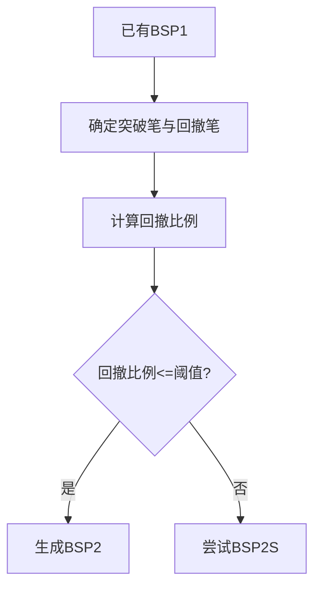

# 10. 二类买卖点（BSP2）

## 定义与职责
二类买卖点用于刻画一类买卖点之后的回撤/反抽确认点，强调回撤幅度与结构连续性。

## 关键字段
- 关联笔：`bi`
- 类型：`T2` 或 `T2S`
- 关联一类买卖点：`relate_bsp1`

## 计算流程中的位置
在一类买卖点生成后，基于突破笔与回撤笔计算二类买卖点。

## 流程图（Mermaid）


## 边界处理与异常校验
1. **依赖一类买卖点**：
   - `bsp2_follow_1=True` 时，若 BSP1 未被输出到 `bsp_store_flat_dict` 则不生成。
2. **回撄比例**：
   - `retrace_rate = bsp2_bi.amp() / break_bi.amp()`，超过 `max_bs2_rate` 时不生成 T2。
3. **样本不足**：
   - `bsp1_bi.idx + 2 >= len(bi_list)` 时直接返回。
4. **首段特殊处理（len(seg_list)==1）**：
   - 无 BSP1，直接用 `bi_list[0]` 作为突破笔、`bi_list[1]` 作为回撄笔。
   - 方向取反（用线段的反方向配置）。
5. **类二扩展（T2S）终止条件**：
   - 从 bsp2_bi 开始每次跳 2 笔向后扫描。
   - **层级限制**：`max_bsp2s_lv` 不为空时，超过此层数则停止。
   - **跨段检查**：若 bsp2s_bi 与 bsp2_bi 不在同一线段，且跨段过多或前段已确定，则停止。
   - **重叠检查**：第一次用 bsp2_bi 与 bsp2s_bi 的重叠确定范围，后续每次检查新笔是否与该范围重叠。
   - **突破检查**：若 bsp2s_bi 的极值超过 break_bi，则停止。
   - **回撄检查**：`abs(bsp2s_bi.end_val - break_bi.end_val) / break_bi.amp() > max_bs2_rate` 则停止。

## 实现流程
1. **定位突破/回撄笔**：多段时用 `bsp1_bi.idx+1` 和 `bsp1_bi.idx+2`；首段时用 `bi_list[0]` 和 `bi_list[1]`。
2. **回撄比例计算**：`bsp2_bi.amp() / break_bi.amp()`。
3. **生成 T2**：比例 ≤ `max_bs2_rate` 则生成。
4. **T2S 扫描**：从 bsp2_bi 起每次跳 2 笔，逐个检查重叠/突破/回撄条件，满足则生成 T2S，不满足则停止。

## 最小流程（伪代码）
```go
func TreatBSP2(seg *Seg, segList []*Seg, biList []*Bi, cfg *PointConfig) {
    var bsp1Bi, breakBi, bsp2Bi *Bi
    if len(segList) > 1 {
        bsp1Bi = seg.EndBi
        if bsp1Bi.Idx+2 >= len(biList) { return }
        breakBi = biList[bsp1Bi.Idx+1]
        bsp2Bi = biList[bsp1Bi.Idx+2]
    } else {
        if len(biList) < 2 { return }
        breakBi = biList[0]
        bsp2Bi = biList[1]
    }
    if cfg.Bsp2Follow1 && (bsp1Bi == nil || !inStore(bsp1Bi.Idx)) { return }
    retrace := bsp2Bi.Amp() / breakBi.Amp()
    if retrace <= cfg.MaxBs2Rate {
        addBS(T2, bsp2Bi, realBsp1)
    }
    // T2S 扫描
    treatBSP2S(biList, bsp2Bi, breakBi, cfg)
}

func treatBSP2S(biList []*Bi, bsp2Bi, breakBi *Bi, cfg *PointConfig) {
    var lo, hi float64
    for bias := 2; bsp2Bi.Idx+bias < len(biList); bias += 2 {
        bsp2sBi := biList[bsp2Bi.Idx+bias]
        if cfg.MaxBsp2sLv != nil && bias/2 > *cfg.MaxBsp2sLv { break }
        if bias == 2 {
            if !hasOverlap(bsp2Bi, bsp2sBi) { break }
            lo = max(bsp2Bi.Low(), bsp2sBi.Low())
            hi = min(bsp2Bi.High(), bsp2sBi.High())
        } else if !hasOverlapRange(lo, hi, bsp2sBi) { break }
        if bsp2sBreak(bsp2sBi, breakBi) { break }
        retrace := abs(bsp2sBi.EndVal()-breakBi.EndVal()) / breakBi.Amp()
        if retrace > cfg.MaxBs2Rate { break }
        addBS(T2S, bsp2sBi, realBsp1)
    }
}
```

## 相关配置（影响该概念）
- `max_bs2_rate`：最大回撤比例（默认：`0.9999`）。
- `bsp2_follow_1`：是否必须跟随 BSP1（默认：`True`）。
- `bsp2s_follow_2`：是否继续生成 BSP2S（默认：`False`）。
- `max_bsp2s_lv`：BSP2S 最大层级（默认：`None`）。
