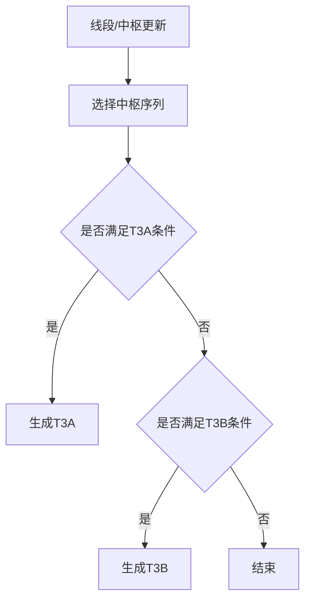

# 11. 三类买卖点（BSP3）

## 定义与职责
三类买卖点用于刻画中枢离开后的再回踩/再反抽结构，分为 T3A（中枢在一类之后）与 T3B（中枢在一类之前）。

## 关键字段
- 关联笔：`bi`
- 类型：`T3A` / `T3B`
- 关联一类买卖点：`relate_bsp1`

## 计算流程中的位置
线段与中枢更新后，基于中枢与下一段/当前段结构判断三类买卖点。

## 流程图（Mermaid）


## 边界处理与异常校验
1. **中枢不足**：
   - 无多笔中枢时不生成三类买卖点。
2. **严格模式（strict_bsp3）**：
   - T3A：要求 `first_zs.bi_in.idx == bsp1_bi.idx + 1`，即中枢进入笔紧接一类买卖点。
   - T3B：要求 `cmp_zs.bi_out.idx == bsp1_bi.idx`，即中枢出场笔就是一类买卖点笔。
3. **回中枢检查（bsp3_back2zs）**：
   - 若 bsp3_bi 回到中枢范围内（下跌笔 low < zs.high 或上涨笔 high > zs.low），则跳过该笔（T3A）或继续（T3B）。
4. **峰值突破检查（bsp3_break_zspeak）**：
   - `bsp3_peak=True` 时，要求 bsp3_bi 突破中枢峰值（下跌 high ≥ peak_high 或上涨 low ≤ peak_low）。
5. **T3A 多中枢循环（bsp3a_max_zs_cnt）**：
   - 遍历下一线段的多笔中枢列表，最多处理 `bsp3a_max_zs_cnt` 个。
   - 每个中枢的 bsp3_bi = `bi_list[zs.bi_out.idx + 1]`。
6. **T3A 终止条件**：
   - `zs.bi_out` 为空或越界。
   - bsp3_bi 与下一线段方向相同。
   - bsp3_bi 跨线段且新段已有 ≥3 笔。
   - bsp3_bi 的 seg_idx 与目标线段不一致且不是尾部线段。
7. **T3B 逻辑**：
   - 使用**前一线段的最后一个多笔中枢**（`get_final_multi_bi_zs`）。
   - 从 `bsp1_bi.idx + 2` 开始每次跳 2 笔，找到第一个不回中枢的笔即生成 T3B并停止。
   - 搜索范围上界由 `cal_bsp3_bi_end_idx` 确定（下一线段第一个多笔中枢的 bi_out）。
8. **首段特殊处理（len(seg_list)==1）**：
   - T3A/T3B 均在当前段内计算，方向取反。

## 实现流程
1. **T3A**：
   - 取下一线段的多笔中枢列表，遍历每个中枢。
   - 对每个中枢，取 `zs.bi_out.idx + 1` 作为 bsp3_bi。
   - 检查方向、跨段、back2zs、break_zspeak。
2. **T3B**：
   - 取前一线段的最后多笔中枢。
   - 从 bsp1_bi.idx+2 每次跳 2 笔，找第一个不回中枢的笔。

## 最小流程（伪代码）
```go
func TreatBSP3After(nextSeg *Seg, cfg *PointConfig, biList []*Bi, bsp1BiIdx int) {
    for zsIdx, zs := range nextSeg.GetMultiBiZsLst() {
        if zsIdx >= cfg.Bsp3aMaxZsCnt { break }
        if zs.BiOut == nil || zs.BiOut.Idx+1 >= len(biList) { break }
        bsp3Bi := biList[zs.BiOut.Idx+1]
        if bsp3Bi.Dir == nextSeg.Dir { break }
        if bsp3Back2zs(bsp3Bi, zs) { continue }
        if cfg.Bsp3Peak && !bsp3BreakZsPeak(bsp3Bi, zs) { continue }
        addBS(T3A, bsp3Bi, realBsp1)
    }
}

func TreatBSP3Before(seg *Seg, bsp1Bi *Bi, cfg *PointConfig, biList []*Bi) {
    cmpZS := seg.GetFinalMultiBiZS()
    if cmpZS == nil || bsp1Bi == nil { return }
    endBiIdx := calBsp3BiEndIdx(nextSeg)
    for _, bsp3Bi := range biList[bsp1Bi.Idx+2::2] {
        if bsp3Bi.Idx > endBiIdx { break }
        if bsp3Back2zs(bsp3Bi, cmpZS) { continue }
        addBS(T3B, bsp3Bi, realBsp1)
        break // T3B 只取第一个
    }
}

func bsp3Back2zs(bi *Bi, zs *ZS) bool {
    return (bi.IsDown() && bi.Low() < zs.High) || (bi.IsUp() && bi.High() > zs.Low)
}

func bsp3BreakZsPeak(bi *Bi, zs *ZS) bool {
    return (bi.IsDown() && bi.High() >= zs.PeakHigh) || (bi.IsUp() && bi.Low() <= zs.PeakLow)
}
```

## 相关配置（影响该概念）
- `bsp3_follow_1`：是否必须跟随 BSP1（默认：`True`）。
- `bsp3_peak`：是否要求突破中枢峰值（默认：`False`）。开启后要求下跌笔 high ≥ peak_high 或上涨笔 low ≤ peak_low。
- `strict_bsp3`：是否严格三类（默认：`False`）。开启后 T3A 要求中枢进入笔紧接 BSP1，T3B 要求中枢出场笔就是 BSP1 笔。
- `bsp3a_max_zs_cnt`：T3A 可遍历的中枢数量（默认：`1`，最小值 1）。
