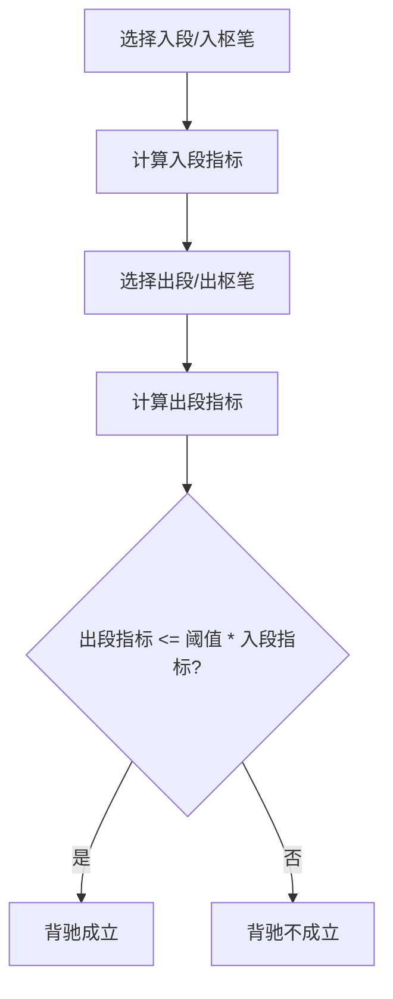

# 12. 背驰（Divergence / MACD 指标）

## 定义与职责
背驰用于判断趋势力度衰减，是一类买卖点与部分三类买卖点的重要判定条件。

## 关键字段
- 指标算法：`macd_algo`
- 比值阈值：`divergence_rate`

## 背驰算法枚举（macd_algo）

### 笔级支持的算法
| 算法名 | 含义 | 计算方式 |
|---------|------|----------|
| `area` | MACD 半面积 | 从笔起/终点开始，累加同号 MACD 柱的绝对值，遇反号则停止。入段从起点往后，出段从终点往前。 |
| `peak` | MACD 峰值 | 笔内同方向 MACD 柱的最大绝对值（上笔取正峰，下笔取负峰）。 |
| `full_area` | MACD 全面积 | 笔内同方向 MACD 柱的绝对值总和（上笔取正值，下笔取负值）。 |
| `diff` | MACD 差值 | 笔内 MACD 柱的最大值与最小值之差。 |
| `slope` | 价格斜率 | `(起终价差) / 起点价 / K线单元数`。 |
| `amp` | 价格振幅 | `(起终价差) / 起点价`。 |
| `amount` | 成交额总和 | 笔内所有K线单元的成交额总和。 |
| `volumn` | 成交量总和 | 笔内所有K线单元的成交量总和。 |
| `amount_avg` | 平均成交额 | 成交额总和 / K线单元数。 |
| `volumn_avg` | 平均成交量 | 成交量总和 / K线单元数。 |
| `turnrate_avg` | 平均换手率 | 换手率总和 / K线单元数。 |
| `rsi` | RSI 指标 | 下跌笔：`10000 / (min(RSI) + 1e-7)`；上涨笔：`max(RSI)`。 |

### 线段级支持的算法
线段级仅支持 `slope` 和 `amp`，其他算法会报错。

## 计算流程中的位置
在中枢与线段完成后，使用“入段/出段”或“入枢/出枢”笔的指标对比进行背驰判断。

## 流程图（Mermaid）


## 边界处理与异常校验
1. **未突破结构**：
   - 出段笔未突破中枢边界（`end_bi_break`），不判定背驰。
2. **指标不可用**：
   - 所有指标计算初始值为 `1e-7`，避免除零。
   - 成交类指标字段缺失时返回 0.0。
   - RSI/KDJ 未开启时不可使用 `rsi` 算法。
3. **阈值过大**：
   - `divergence_rate > 100` 时直接判定背驰成立（默认 `inf` 即始终成立）。
4. **方向一致性**：
   - in_metric 使用 `is_reverse=False`（从起点方向计算）。
   - out_metric 使用 `is_reverse=True`（从终点方向反向计算）。
   - 仅 `area` 算法区分 obverse/reverse，其他算法不受影响。

## 实现流程
1. **入段指标**：计算 `bi_in.cal_macd_metric(macd_algo, is_reverse=False)`。
2. **出段指标**：计算 `end_bi.cal_macd_metric(macd_algo, is_reverse=True)`。
3. **背驰判断**：`out_metric <= divergence_rate * in_metric` 时成立。
4. **返回值**：`(is_divergence, out_metric / in_metric)`。

## 最小流程（伪代码）
```go
func (zs *ZS) IsDivergence(cfg *PointConfig, outBi *Bi) (bool, float64) {
    if !zs.EndBiBreak(outBi) { return false, 0 }
    inMetric := zs.BiIn().CalMacdMetric(cfg.MacdAlgo, false)
    var outMetric float64
    if outBi == nil {
        outMetric = zs.BiOut().CalMacdMetric(cfg.MacdAlgo, true)
    } else {
        outMetric = outBi.CalMacdMetric(cfg.MacdAlgo, true)
    }
    if cfg.DivergenceRate > 100 { return true, outMetric / inMetric }
    return outMetric <= cfg.DivergenceRate*inMetric, outMetric / inMetric
}
```

### 笔级指标计算示例（伪代码）
```go
func (bi *Bi) CalMacdMetric(algo MACDAlgo, isReverse bool) float64 {
    switch algo {
    case AREA:
        if isReverse { return bi.CalMACDHalfReverse() }
        return bi.CalMACDHalfObverse()
    case PEAK:
        return bi.CalMACDPeak()
    case FULL_AREA:
        return bi.CalMACDArea()
    case DIFF:
        return bi.CalMACDDiff()
    case SLOPE:
        return bi.CalMACDSlope()
    case AMP:
        return bi.CalMACDAmp()
    case AMOUNT:
        return bi.CalTradeMetric("turnover", false)
    case VOLUMN:
        return bi.CalTradeMetric("volume", false)
    case AMOUNT_AVG:
        return bi.CalTradeMetric("turnover", true)
    case VOLUMN_AVG:
        return bi.CalTradeMetric("volume", true)
    case TURNRATE_AVG:
        return bi.CalTradeMetric("turnover_rate", true)
    case RSI:
        return bi.CalRsi()
    }
}
```

## 相关配置（影响该概念）
- `divergence_rate`：背驰阈值（默认：`inf`）。
- `macd_algo`：背驰算法（默认：`peak`）。
